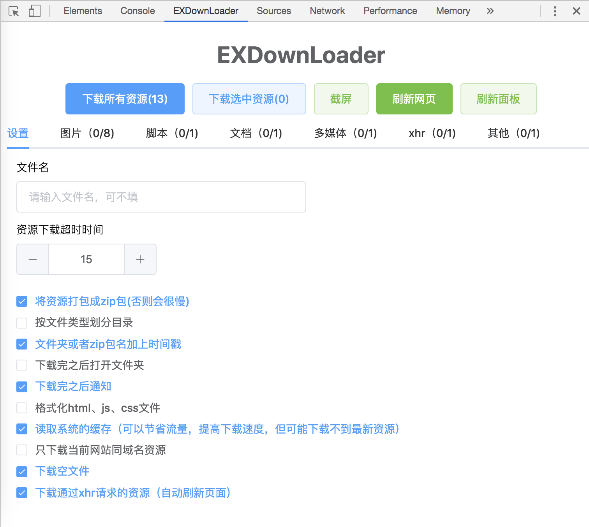
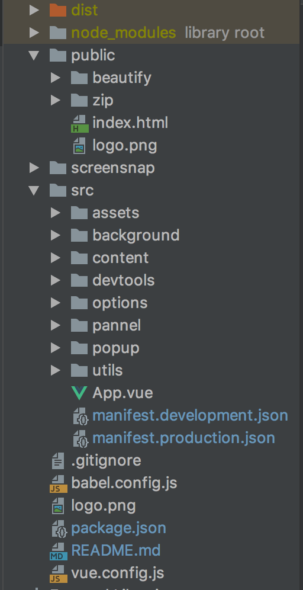
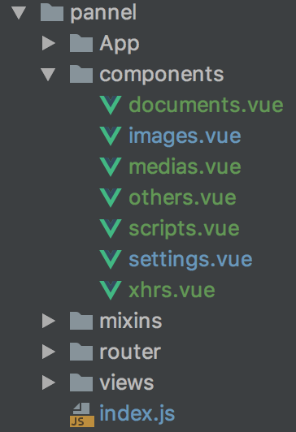
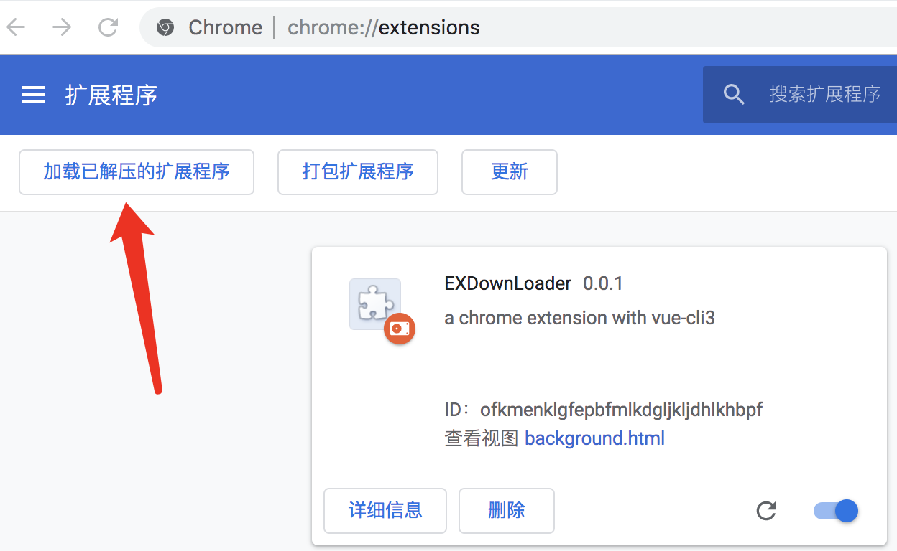
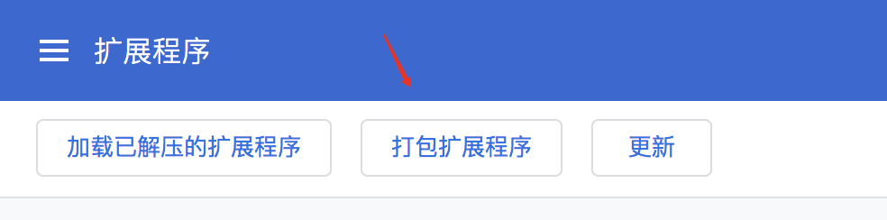
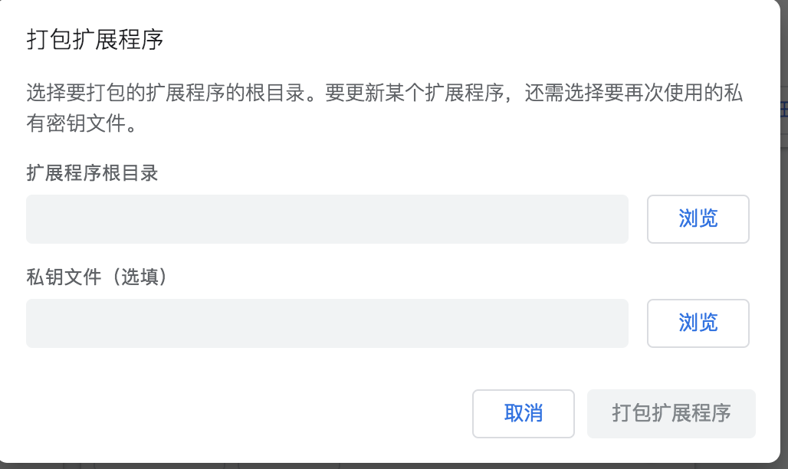

# EXDownLoader 
`vue-cli3` + `webpack4` + `element-ui`  实现编译打包Chrome浏览器插件<br />
## 界面预览
{:height="100" width="100"}


## 项目目录
<br/>

1、dist是生成的插件目录，可以直接被浏览器扩展加载。<br/>
2、public是静态资源目录，js不会被编译，beautify是格式化html、js、css的工具类，zip是将文件打包成zip格式的工具类。<br/>
3、src是项目的源码，manifest.development.json和manifest.production.json是插件的manifest配置文件，具体可以查看chrome的文档。<br/>
4、utils/index.js是下载的核心逻辑，所有与chrome api相关的代码都在此文件里面，hot-reload.js是热更新文件。<br/>
5、panel目录是开发者工具插件的页面。<br/>



## 环境安装
```
npm install 或 cnpm install
```

### 开发环境
```
npm run serve
or
npm run build-watch
```

### 生产环境打包
```
npm run build
```

### 分析包组件大小
```
npm run analyze
```

### eslint语法检测
```
npm run lint
```

### vue-cli3配置文档
[vue-cli3配置文档](https://cli.vuejs.org/config/).

### Element文档
[Element文档](https://element.eleme.cn/#/zh-CN/guide/design).

### chrome开发文档
官网被墙，可以看这位大佬的 [去看看](https://github.com/sxei/chrome-plugin-demo).

### 主要学习的开源项目
[ResourcesSaverExt](https://github.com/up209d/ResourcesSaverExt/).

### 开发步骤
1、执行npm run build-watch，可以热更新，但是devtools界面是不能自动刷新的，可以点击页面上的刷新面板按钮进行刷新。<br />
2、插件安装，两种方式：<br />
   a、加载根目录的dist文件夹<br />
   
   b、将打包之后的dist.crx直接拖入chrome/qq浏览器/360浏览器等chrome内核浏览器的扩展组件页面里<br />
3、打包插件，可以直接在谷歌浏览器上打包。打包成功后会在根目录下面生成dist.crx,dist.pem文件。<br />





## 打赏鼓励一下，^_^

